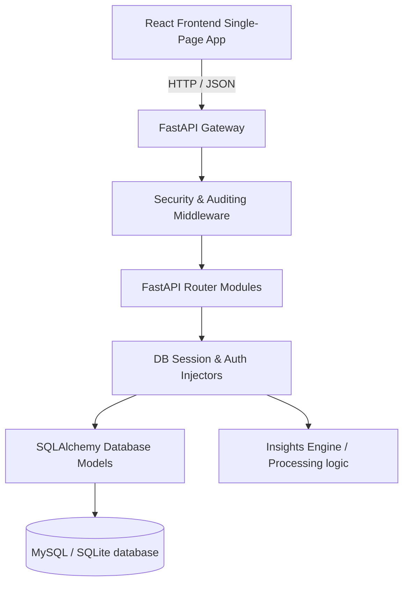
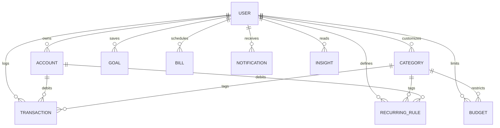

# ExpenseFlow AI — Architecture Guide

This document describes the software architecture, folder structures, database ER diagram, and security constraints of **ExpenseFlow AI**.

---

## 🏗️ Clean Architecture Overview

ExpenseFlow AI uses a separated Clean Architecture approach for its frontend and backend stacks.



- **Frontend (Vite + React)**: Decoupled client communicating with the API via an asynchronous HTTP client client wrapper (`api.js`). Routes are split at build time using lazy loading chunks to optimize initial loading speeds.
- **Backend (FastAPI)**: REST interface utilizing class dependencies for request context. Session lifetimes are pooled efficiently using SQLAlchemy connection pools (`SessionLocal`).

---

## 🗄️ Database Entity-Relationship (ER) Diagram

The following diagram maps out all relational models defined in the SQLAlchemy database layout.



---

## 📂 Core Folder Structure

```
ExpenseFlowAI/
├── backend/
│   ├── app/
│   │   ├── core/           # Configs, Security primitives
│   │   ├── database/       # Session setups
│   │   ├── middleware/     # Security headers, Limiter, Audit logging
│   │   ├── models/         # SQLAlchemy DB classes
│   │   ├── routers/        # Router handlers (Auth, Budgets, Exports, etc.)
│   │   ├── schemas/        # Pydantic validation schemas
│   │   └── services/       # Insights engine, intelligence processors
│   └── tests/              # End-to-end integration test suite
└── frontend/
    ├── src/
    │   ├── components/     # Toast, dialogs, layout, sidebar
    │   ├── context/        # Auth states, Toast context
    │   ├── pages/          # Analytics, Bills, Goals, Settings
    │   └── services/       # Axios API client wrapper
```
